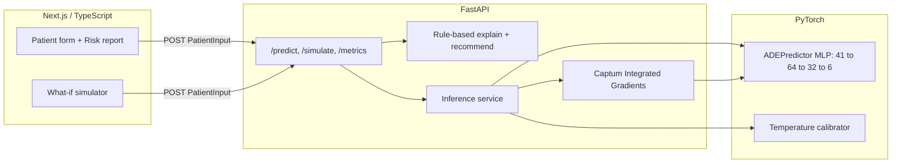

# Clinisight

Inpatient medication-safety prototype. Given a patient's vitals, labs, and
current medications, Clinisight predicts risk for six adverse drug events,
explains what's driving each prediction, and lets a clinician test a safer
regimen before the order is signed.

**Not clinically validated. Prototype for demonstration only.**

## The problem

Preventable adverse drug events (ADEs) are one of the most common sources of
inpatient harm. AHRQ estimates 380,000–450,000 preventable ADEs occur in U.S.
hospitalized patients each year, adding roughly 1.7 days of length of stay and
$2,000+ in cost per event ([AHRQ Statistical Brief #164, 2011](https://www.ncbi.nlm.nih.gov/books/NBK174680/)).
The Institute of Medicine puts the broader national total at around 1.5
million preventable ADEs a year.

Most hospitals already have medication alerting in their EHR, and it isn't
working well enough: one national analysis estimated 5.5 million
medication-related alerts get overridden inappropriately each year, causing
about 196,600 preventable ADEs and $871M–$1.8B in avoidable treatment cost
([Wong A et al., *JAMIA*, 2018](https://pmc.ncbi.nlm.nih.gov/articles/PMC7646874/)).
That's alert fatigue: clinicians see so many low-value popups that they stop
reading the ones that matter.

Clinisight's bet is that a risk *score* with a *reason* and a *what-if* is
more useful than a binary interaction popup. Instead of "these two drugs
interact," it shows how much risk actually changes for this specific patient,
and lets the clinician try an alternative before deciding.

## What it does

1. Enter a patient's demographics, vitals, labs, comorbidities, and current
   medications (or load one of three demo cases).
2. Run Predict. Clinisight returns risk for six ADEs (AKI, hyperkalemia, QT
   prolongation, liver toxicity, bleeding, hypoglycemia), each with the model's
   actual attributions plus a guideline-aligned factor checklist.
3. For any elevated risk, the report suggests a concrete next action tagged to
   its source guideline (KDIGO, HAS-BLED, ADA, Beers, ACG).
4. In the what-if panel, toggle a medication and watch every risk score and
   suggested action update live against the baseline.

## Demo cases

Three inpatient personas ship with the app:

| Persona | Setup | What to show |
|---|---|---|
| Margaret Chen, 72F | CKD on lisinopril, ibuprofen just added for pain | AKI/hyperkalemia risk climbs; swap to acetaminophen in what-if and watch it drop |
| James Okonkwo, 58M | Heart failure on warfarin, new azithromycin + ondansetron | QT and bleeding risk stack; remove one QT-risk drug in what-if |
| Rosa Alvarez, 64F | Insulin-treated diabetes, reduced kidney clearance | Hypoglycemia risk from renally-cleared antidiabetics |

## Architecture



The frontend never talks to the model directly. The FastAPI backend owns
inference, calibration, attribution, and the rule-based explanation/action
layer, and returns one JSON response per prediction with all four.

**Stack:** Next.js 16 + React 19 + TypeScript + Tailwind + react-hook-form on
the frontend; FastAPI + PyTorch + Captum + scikit-learn on the backend.

## Quickstart

Two terminals: one for the backend, one for the frontend.

```bash
# Backend
cd backend
pip install -r requirements.txt   # plus a matching torch build for your platform
uvicorn app.main:app --reload --host 0.0.0.0 --port 8000

# Frontend
cd frontend
npm install
npm run dev
```

Open `http://localhost:3000`. To hit the backend from another device on the
same network, both dev servers already listen on all interfaces; the frontend
picks up the backend automatically from whatever host you loaded the page
from (see `frontend/lib/api.ts`), or set `NEXT_PUBLIC_API_URL` to override it.

Artifacts (`backend/artifacts/`) and processed data (`backend/data/`) ship
committed, so the app runs out of the box. To regenerate from scratch:

```bash
cd backend
python -m ml.generate_data   # synthetic patients + train/val/test split
python -m ml.train           # trains ADEPredictor, saves model.pt + scaler
python -m ml.evaluate        # test metrics + temperature calibration -> metrics.json
```

Run tests with `pytest` from `backend/` (23 tests: eGFR math, schema
validation, drug interactions, calibration, attribution shape, and the
`/predict` contract).

## Model & metrics

MLP (41 inputs, two hidden layers of 64/32, BatchNorm + dropout, 6 sigmoid
outputs), trained with `BCEWithLogitsLoss` + AdamW on 10,000 synthetic
patients (7,000/1,500/1,500 train/val/test split), with probabilities
temperature-scaled per outcome on the validation set. Current held-out test
metrics ([`backend/artifacts/metrics.json`](backend/artifacts/metrics.json),
also served live at `/metrics` and shown in the app's Model Card):

| Outcome | AUROC | AUPRC | Brier | Prevalence |
|---|---|---|---|---|
| AKI | 0.760 | 0.600 | 0.170 | 30.5% |
| Hyperkalemia | 0.778 | 0.599 | 0.165 | 29.3% |
| QT prolongation | 0.757 | 0.405 | 0.111 | 15.3% |
| Liver toxicity | 0.638 | 0.292 | 0.096 | 11.6% |
| Bleeding risk | 0.672 | 0.370 | 0.140 | 18.7% |
| Hypoglycemia | 0.705 | 0.456 | 0.157 | 23.2% |

Macro AUROC 0.718, macro Brier 0.140, macro ECE 0.028. These are metrics on a
synthetic test set, not clinical validation. They mainly demonstrate that the
labels are learnable and the model isn't badly miscalibrated, not that this
would perform this way on real patients.

## Explainability

Every prediction carries two distinct kinds of explanation, and the UI keeps
them visually separate on purpose:

- **Model drivers**: signed feature attributions from Captum's Integrated
  Gradients run on the actual trained network. These change per patient and
  reflect what the model is really doing.
- **Clinical factors**: a static guideline checklist (KDIGO, HAS-BLED, ADA,
  Beers, ACG) generated by rule-based logic in `explain.py`. These explain the
  *domain reasoning*, not the network's internals, and won't always line up
  with the model drivers.

Conflating the two would be misleading, so the report labels them separately
instead of blending them into one "why" list.

## Clinical basis

Every synthetic risk factor is grounded in a real guideline or published
association, not an arbitrary rule. See
[`docs/clinical-basis.md`](docs/clinical-basis.md) for the full outcome to
risk-factor to citation mapping (KDIGO AKI/CKD guidelines, the "triple
whammy" NSAID+ACE-I interaction, HAS-BLED bleeding domains, ADA hypoglycemia
guidance, and more).

## Limitations

1. All patient data is synthetic. Labels are noisy draws from literature-
   informed risk logits, not real hospital outcomes, so the metrics above
   don't say anything about real-world accuracy.
2. Risk factor coefficients encode *direction*, not fitted odds ratios from a
   single meta-analysis.
3. Medications are a curated list of 18 common inpatient drugs with static
   pairwise interaction rules, not a full RxNorm drug-interaction checker.
4. Model drivers (Captum) and clinical factors (guideline checklist) come
   from two different systems and can disagree; that's intentional, but worth
   knowing before treating them as one explanation.

## Path to clinic (hypothetical)

If this moved past a demo, the realistic next step isn't a straight jump to
production. It's a silent pilot: run the model alongside existing care for a
few months without showing clinicians anything, and check whether its risk
rankings would have flagged the ADEs that actually occurred. Only after that
holds up would it be worth exposing predictions live, starting in shadow mode
with override tracking (the same kind of override-rate metric behind the
alert-fatigue numbers above) before any alert is allowed to interrupt a
workflow.

## Project structure

```
backend/
  app/            FastAPI app: routes, schemas, services (inference, explain, attribution)
  ml/             Data generation, model, training, evaluation, calibration, drug catalog
  artifacts/      Trained model + scaler + calibrator + metrics.json
  tests/          pytest suite
frontend/
  app/            Next.js App Router pages
  components/     Form, risk report, what-if simulator, model card, etc.
  lib/            API client, validation, drug catalog, history, risk formatting
docs/
  clinical-basis.md   Outcome -> risk factor -> citation mapping
  demo-script.md       ~3 minute walkthrough script
```
