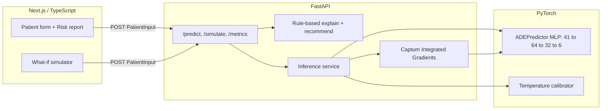

# Clinisight

Inpatient medication-safety prototype: score ADE risk from vitals, labs, and meds, show what's driving it, and try a safer regimen before the order is signed.

**Not clinically validated. Prototype for demonstration only.**

## Inspiration

Hospital alert systems already warn about drug interactions, but clinicians override a huge share of them. The signal gets buried. I built Clinisight for the gap between a binary popup and an actual prescribing decision: give a patient-specific risk estimate, show an explanation someone can check, and let them see how a med change would move that risk before anything is signed.

## Features

- Calibrated risk for six ADEs (AKI, hyperkalemia, QT prolongation, liver toxicity, bleeding, hypoglycemia)
- Captum Integrated Gradients attributions, shown separately from a guideline-based clinical factor checklist
- Suggested next actions tagged to KDIGO, HAS-BLED, ADA, Beers, ACG, and similar sources
- What-if simulation: add or remove medications and compare against the baseline prediction
- Three demo personas you load on click (nothing is pre-filled on open)
- Model card backed by `/metrics`
- Local history so you can restore and compare past runs

## Demo

- Live site: [clinisight.vercel.app](https://clinisight.vercel.app)
- Demo script: [`docs/demo-script.md`](docs/demo-script.md)

## Tech Stack

Frontend:
- Next.js
- React
- TypeScript
- Tailwind CSS
- react-hook-form + Zod

Backend:
- FastAPI
- Python
- Pydantic
- Uvicorn

ML:
- PyTorch
- Captum
- scikit-learn
- NumPy / pandas

Deployment:
- Vercel (frontend)
- Render (API)

## Architecture

The browser never loads the model. It sends a `PatientInput` to FastAPI on `/predict` or `/simulate`, and the backend does the rest.

Under the hood, inference goes through a small MLP (41 → 64 → 32 → 6). Probabilities get temperature-scaled per outcome. Captum runs Integrated Gradients for attributions. A separate rule engine adds guideline factors and recommended actions. The API returns all of that in one JSON payload.



Patients in training are synthetic. The risk factors behind those labels still map to real guidelines and published associations; see [`docs/clinical-basis.md`](docs/clinical-basis.md). Macro AUROC on the held-out synthetic test set is about 0.718. Useful as a sanity check, not as clinical proof.

One design choice worth calling out: model drivers and clinical factors are allowed to disagree. Collapsing them into a single explanation would make it unclear which system said what.

## Installation

```bash
git clone https://github.com/JialaiYing/Clinisight.git
cd Clinisight
```

You'll need two processes running.

```bash
# Backend
cd backend
pip install -r requirements.txt
# Use a torch build that matches your platform: https://pytorch.org
uvicorn app.main:app --reload --host 0.0.0.0 --port 8000
```

```bash
# Frontend
cd frontend
npm install
npm run dev
```

Then open [http://localhost:3000](http://localhost:3000). The form is blank until you click a demo case or fill it yourself. Locally the UI talks to `http://127.0.0.1:8000`; override that with `NEXT_PUBLIC_API_URL` if the API lives somewhere else.

`backend/artifacts/` already has the trained model, scaler, calibrator, and metrics, so prediction works out of the box. Retrain from scratch only if you want to:

```bash
cd backend
python -m ml.generate_data
python -m ml.train
python -m ml.evaluate
```

```bash
cd backend
pytest
```
