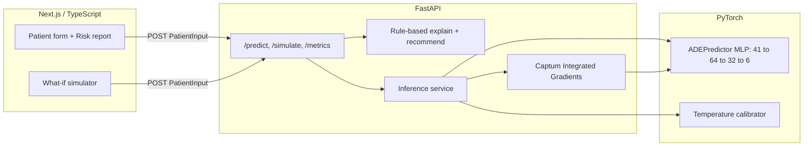

# Clinisight

Inpatient medication-safety prototype that estimates adverse drug event (ADE) risk from patient vitals, labs, and medications, surfaces model and guideline-based drivers, and supports regimen comparison before an order is signed.

**Not clinically validated. Prototype for demonstration only.**

## Problem

Preventable ADEs remain a major source of inpatient harm. AHRQ estimated 380,000 to 450,000 preventable ADEs among U.S. hospitalized patients each year, adding roughly 1.7 days of length of stay and more than $2,000 in cost per event ([AHRQ Statistical Brief #164, 2011](https://www.ncbi.nlm.nih.gov/books/NBK174680/)). Broader Institute of Medicine estimates place national preventable ADE burden near 1.5 million events annually ([IOM, *Preventing Medication Errors*, 2006](https://nap.nationalacademies.org/catalog/11623/preventing-medication-errors)).

Existing EHR medication alerting has not closed that gap. In one national analysis, an estimated 5.5 million medication-related alerts were overridden inappropriately each year, associated with about 196,600 preventable ADEs and $871 million to $1.8 billion in avoidable treatment cost ([Wong A et al., *JAMIA*, 2018](https://pmc.ncbi.nlm.nih.gov/articles/PMC7646874/)). High override rates are the operational face of alert fatigue: frequent low-yield warnings reduce attention to the alerts that matter.

The content of those alerts is also limited. A binary interaction message states that two drugs interact. It does not quantify how risk shifts for a specific patient's renal function, QT liability, or bleeding profile, and it typically does not support comparing a safer alternative before the order is signed. The result is interruptive noise without a patient-specific decision aid.

## Solution

Clinisight reframes the workflow as patient-specific risk estimation plus explanation and counterfactual review.

Given demographics, vitals, labs, comorbidities, and a current medication list (or a demo persona), the system returns calibrated probabilities for six inpatient ADEs: AKI, hyperkalemia, QT prolongation, liver toxicity, bleeding, and hypoglycemia. Each outcome includes two distinct explanation channels: signed feature attributions from the trained network via Captum Integrated Gradients, and a separate guideline-aligned factor checklist drawn from sources such as KDIGO, HAS-BLED, ADA, Beers, and ACG. Elevated risks also produce suggested next actions tagged to those sources.

A what-if panel lets medications be added or removed and re-runs inference against the baseline prediction so risk scores and recommendations update before signing. Same patient context, controlled regimen change, live comparison.

The implementation is a FastAPI service for inference, temperature calibration, attribution, and rule-based explanation/recommendation, with a Next.js client for data entry and reporting. Training labels are synthetic and literature-informed; factor-to-citation mapping is documented in [`docs/clinical-basis.md`](docs/clinical-basis.md). Prototype only; not validated for clinical use.

## Features

- Calibrated risk scores for six ADEs: AKI, hyperkalemia, QT prolongation, liver toxicity, bleeding, and hypoglycemia
- Dual explanation layers kept separate: Captum Integrated Gradients attributions and a guideline-based clinical factor checklist (KDIGO, HAS-BLED, ADA, Beers, ACG, and related sources)
- Suggested next actions for elevated risks, tagged to the corresponding guideline sources
- What-if simulation to add or remove medications and compare against the baseline prediction
- Three click-to-load demo personas (Margaret Chen, James Okonkwo, Rosa Alvarez); the form initializes blank
- Pairwise interaction alerts from a curated inpatient drug catalog
- Clinician handoff export (copy / print) summarizing the case and prediction
- Model card backed by `/metrics`, with local prediction history for restore and compare

## Demo

- Live site: [clinisight.vercel.app](https://clinisight.vercel.app)
- Walkthrough: [`docs/demo-script.md`](docs/demo-script.md)

Suggested path: open the live site, load **Margaret Chen**, run Predict, expand the AKI card, then replace ibuprofen with acetaminophen in the what-if panel and observe AKI and hyperkalemia risk decline.

Additional personas: **James Okonkwo** (QT and bleeding risk under warfarin with azithromycin and ondansetron) and **Rosa Alvarez** (hypoglycemia risk with renally cleared antidiabetics).

## Tech Stack

Frontend:
- Next.js
- React
- TypeScript
- Tailwind CSS
- react-hook-form + Zod

Backend:
- FastAPI
- Python
- Pydantic
- Uvicorn

ML:
- PyTorch
- Captum
- scikit-learn
- NumPy / pandas

Deployment:
- Vercel (frontend)
- Render (API)

## Architecture

The client does not load the model. It posts a `PatientInput` to FastAPI (`/predict` for the primary report, `/simulate` for what-if). Inference and explanation run entirely on the server.

The predictor is a multilayer perceptron with 41 inputs, hidden widths 64 and 32, and six sigmoid outputs. Features include demographics, vitals, labs (eGFR via CKD-EPI 2021), comorbidities, concurrent medication count, and a multi-hot encoding over 18 curated inpatient drugs. Training used `BCEWithLogitsLoss` and AdamW on 10,000 synthetic patients (7,000 / 1,500 / 1,500 train / val / test). Per-outcome temperature scaling is fit on the validation set to improve probability calibration relative to raw logits.

At prediction time, Captum Integrated Gradients produces signed attributions over the scaled input. A separate rule engine constructs guideline factors and recommended actions from labs, comorbidities, and the drug catalog. The two explanation sources are not merged. The API returns a single JSON payload containing risks, attributions, clinical factors, recommendations, interaction alerts, overall risk band, confidence, computed eGFR, and a disclaimer.



Training labels are synthetic. Encoded risk factors still follow published associations and guideline themes; see [`docs/clinical-basis.md`](docs/clinical-basis.md). On the held-out synthetic test set, macro AUROC is approximately 0.718, macro Brier 0.140, and macro ECE 0.028. Those figures support that the labels are learnable and calibration is reasonable on this dataset. They are not evidence of clinical performance.

Model attributions and guideline factors can diverge. They remain labeled separately so it stays clear which signal came from the network and which came from the rule layer.

## Installation

```bash
git clone https://github.com/JialaiYing/Clinisight.git
cd Clinisight
```

Start the API and the frontend in separate terminals.

```bash
# Backend
cd backend
pip install -r requirements.txt
# Use a torch build that matches the local platform: https://pytorch.org
uvicorn app.main:app --reload --host 0.0.0.0 --port 8000
```

```bash
# Frontend
cd frontend
npm install
npm run dev
```

Open [http://localhost:3000](http://localhost:3000). The form remains blank until a demo persona is selected or fields are entered manually. The client defaults to `http://127.0.0.1:8000`; set `NEXT_PUBLIC_API_URL` to point at a remote API.

When the page is loaded from another device on the same LAN, both servers listen on all interfaces and the client targets that host on port 8000 unless `NEXT_PUBLIC_API_URL` is set.

Trained artifacts are included under `backend/artifacts/` (model, scaler, calibrator, metrics), so inference works without retraining. To regenerate data and retrain:

```bash
cd backend
python -m ml.generate_data
python -m ml.train
python -m ml.evaluate
```

```bash
cd backend
pytest
```
